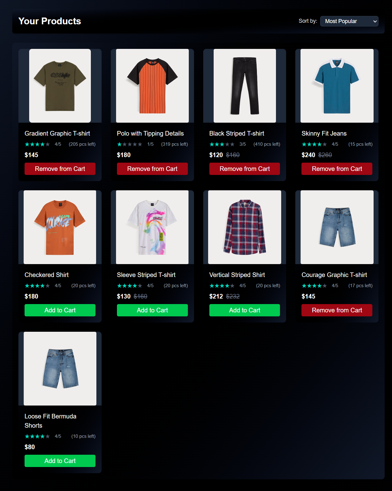
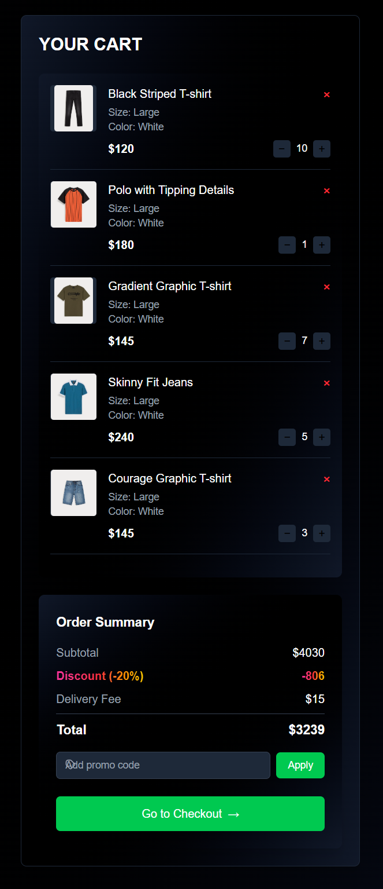
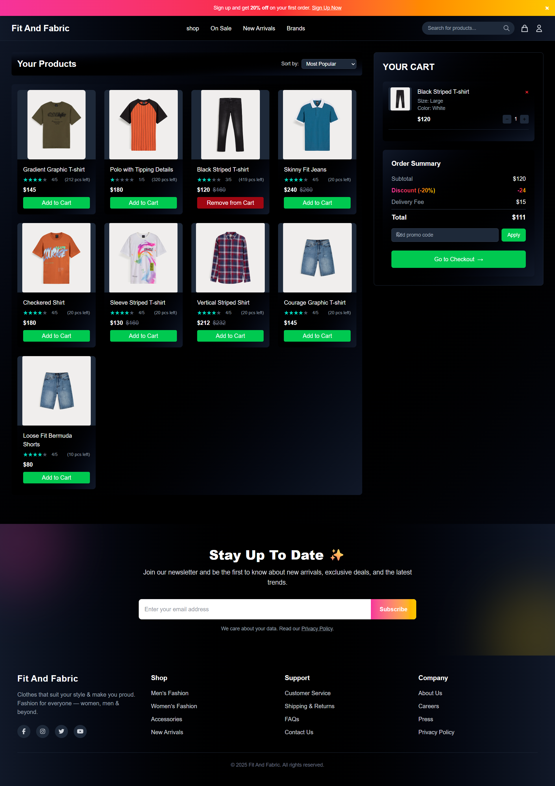

# 🛍️ Fit and Fabric – Shopping Web App

**Fit and Fabric** is a responsive single-page shopping web application built with **React**, **Tailwind CSS**, and **Vite**.  
It allows users to browse and buy products like **T-Shirts** and **Pants**, manage their cart, and complete checkout with discounts and price details.

## [🚀 Live Demo:](https://fit-and-fabric.vercel.app)

---

## 📌 Features

- 🛒 **Product Listing** – Browse items like T-Shirts & Pants  
- 🛒 **Product Sorting** – Sort Based on most popular,newest, price high to low, low to high
- 🔍 **Search Bar** – Find products easily by title  
- ➕ **Add to Cart** – Add selected items to the cart  
- 🛍️ **Cart Management** – View and update product quantities  
- 💰 **Price Calculation** – Displays:
  - Original Price  
  - 20% Discounted Price (auto-applied for all users)  
  - Total Price (including delivery charge)  
- 📊 **Order Summary** – Right-side cart with detailed pricing  
- ✅ **Checkout Flow** – Click checkout button to confirm order  
- 📦 **Order Confirmation Modal** – Pops up after checkout  
- 📱 **Responsive Design** – Works seamlessly across all devices  

---

---

## 🛠️ Tech Stack

- **React**
- **Tailwind CSS**
- **Vite**
- **Fontawesome Icons**

---

## 📁 Folder Structure

```
fit-and-fabric
├── src
│   ├── reducer
│   │   └── ProductReducer.js
│   ├── products
│   │   ├── CartItem.jsx
│   │   ├── OrderSummary.jsx
│   │   ├── ProductBar.jsx
│   │   ├── ProductCard.jsx
│   │   ├── ProductList.jsx
│   │   └── Rating.jsx
│   ├── data
│   │   └── product.js
│   ├── context
│   │   └── context.js
│   ├── components
│   │   ├── Announcement.jsx
│   │   ├── Footer.jsx
│   │   ├── Header.jsx
│   │   ├── NavLinks.jsx
│   │   ├── Newsletter.jsx
│   │   └── ProductBoard.jsx
│   ├── assets
│   │   ├── svg
│   │   │   ├── Cart.jsx
│   │   │   ├── OrSummary.jsx
│   │   │   ├── Search.jsx
│   │   │   └── User.jsx
│   │   └── img
│   │       ├── image 1.png
│   │       ├── image 10-1.png
│   │       ├── image 10-2.png
│   │       ├── image 10.png
│   │       ├── image 7-1.png
│   │       ├── image 7.png
│   │       ├── image 8-1.png
│   │       ├── image 8-2.png
│   │       ├── image 8.png
│   │       ├── image 9-1.png
│   │       ├── image 9-2.png
│   │       └── image 9.png
│   ├── App.jsx
│   ├── index.css
│   └── main.jsx
├── public
│   └── logo.png
├── .gitignore
├── eslint.config.js
├── index.html
├── jsconfig.json
├── package-lock.json
├── package.json
├── README.md
└── vite.config.js
```


---

## 📸 Screenshots

### 🖼️ Package



### 🖼️ Full Preview



### 🖼️ Full page



---

## 👥 How to Clone, Setup & Run

### 📥 Clone the Repository

```bash
git clone https://github.com/devo-ab/fit-and-fabric.git
cd fit-and-fabric
```

### Install Dependencies

```
npm install
```

### Start Development Server

```
npm run dev
```

### Build for Production

```
npm run build
```

### Preview Production Build

```
npm run preview
```

# 👤 Author

# Avi Jit

## :mailbox: Reach me out

<p align="left">
<a href="https://linkedin.com/in/itsavijitb" target="blank"></a>
<a href="https://twitter.com/itsavijitb" target="blank"></a>
<a href="https://facebook.com/itsavijitb" target="blank"></a>
<a href="https://instagram.com/itsavijitb" target="blank"></a>
</p>
